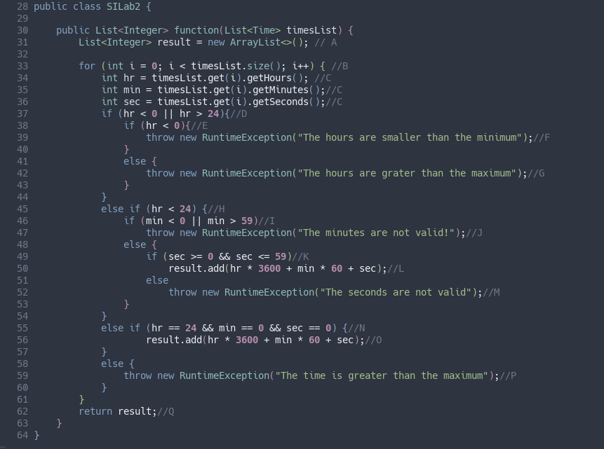
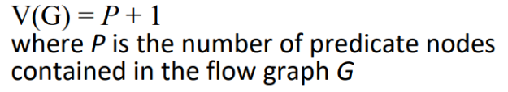
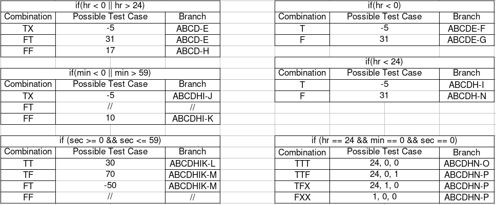

# Втора лабораториска вежба - Софтверско инженерство
## Иван Трајков, бр. на индекс 186121

#### Именување на јазлите во кодот

### Цикломатска комплексност
Цикломатската комплексност е 8 и е добиена со следната формула.

### Тест случаи според критериумот Multiple Condition
Тестови кои ги покриваат сите вистинитосни вресности на поединечните услови.

### Тест случаи според критериумот Every statement

### Објаснување на напишаните unit tests 
