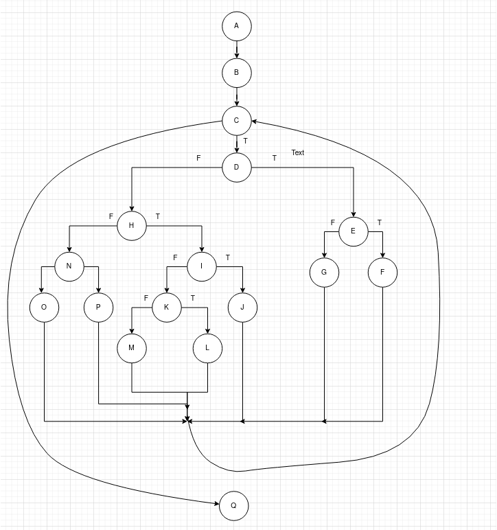

# Втора лабораториска вежба - Софтверско инженерство
## Иван Трајков, бр. на индекс 186121

### Цикломатска комплексност

### Тест случаи според критериумот Every statement

### Тест случаи според критериумот Multiple Condition

### Објаснување на напишаните unit tests 
